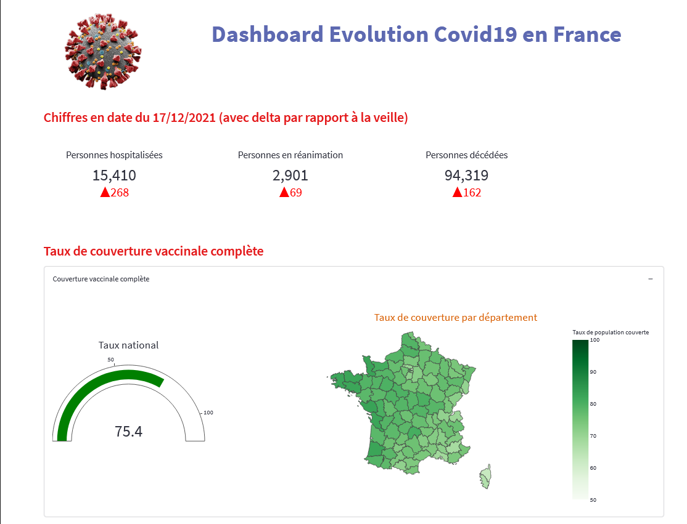
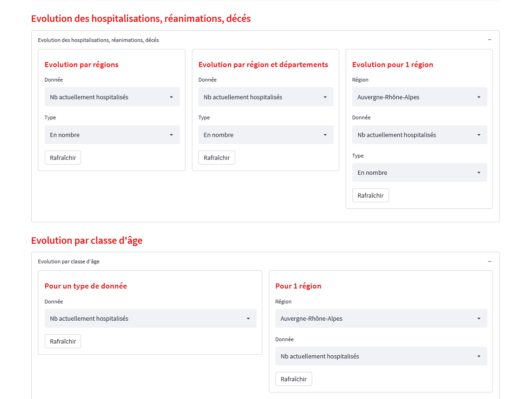
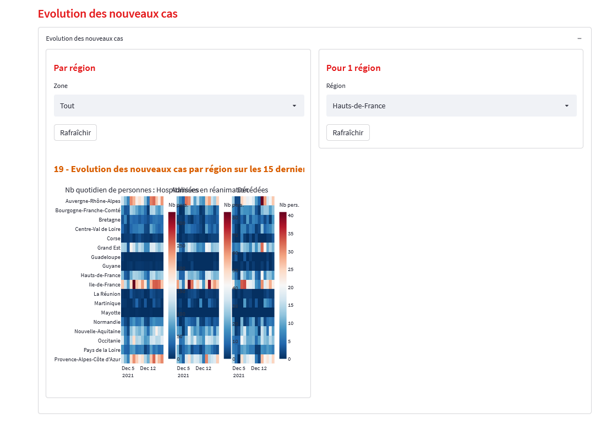
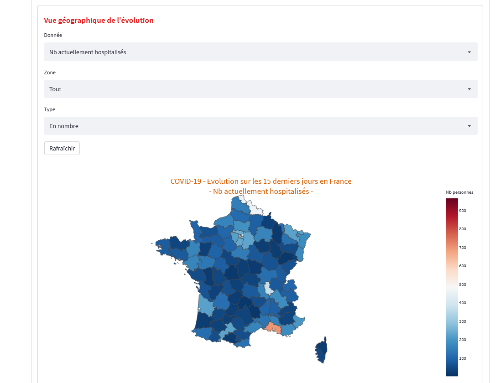

# Streamlit App for for monitoring the evolution of Covid-19 in France

This interactive dashboard offers different views of the evolution of the Covid-19 epidemic in France:

* national summary of the evolution of people hospitalized, in intensive care, deceased
* status of vaccination coverage
* regional evolution
* evolution by age group
* evolution of new cases over the last 15 days.

This app is developed and deployed with [Streamlit](https://streamlit.io/).
